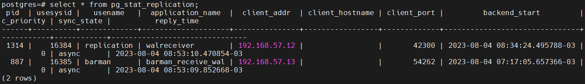
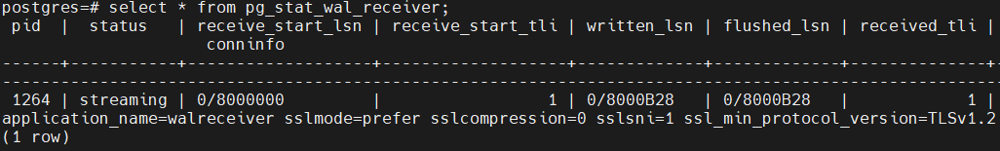

# Vagrant-стенд c Postgres

## Цели домашнего задания
Научиться настраивать репликацию и создавать резервные копии в СУБД PostgreSQL

## Описание домашнего задания
1) Настроить hot_standby репликацию с использованием слотов
2) Настроить правильное резервное копирование


## Приступаем к настройке репликации: 
### На хосте node1:

Проверяем, что наши конфиги скопировались:

[root@node1 ~]# cat /var/lib/pgsql/14/data/postgresql.conf
```
[root@node1 ~]# cat /var/lib/pgsql/14/data/postgresql.conf
#Указываем ip-адреса, на которых postgres будет слушать трафик на порту 5432 (параметр port)
listen_addresses = 'localhost, 192.168.57.11'
#Указываем порт порт postgres
port = 5432
#Устанавливаем максимально 100 одновременных подключений
max_connections = 100
log_directory = 'log'
log_filename = 'postgresql-%a.log'
log_rotation_age = 1d
log_rotation_size = 0
log_truncate_on_rotation = on
max_wal_size = 1GB
min_wal_size = 80MB
log_line_prefix = '%m [%p] '
#Указываем часовой пояс для Москвы
log_timezone = 'UTC+3'
timezone = 'UTC+3'
datestyle = 'iso, mdy'
lc_messages = 'en_US.UTF-8'
lc_monetary = 'en_US.UTF-8'
lc_numeric = 'en_US.UTF-8'
lc_time = 'en_US.UTF-8'
default_text_search_config = 'pg_catalog.english'
#можно или нет подключаться к postgresql для выполнения запросов в процессе восстановления;
hot_standby = on
#Включаем репликацию
wal_level = replica
#Количество планируемых слейвов
max_wal_senders = 3
#Максимальное количество слотов репликации
max_replication_slots = 3
#будет ли сервер slave сообщать мастеру о запросах, которые он выполняет.
hot_standby_feedback = on
#Включаем использование зашифрованных паролей
password_encryption = scram-sha-256

```
[root@node1 ~]# cat /var/lib/pgsql/14/data/pg_hba.conf
```# TYPE  DATABASE        USER            ADDRESS                 METHOD
# "local" is for Unix domain socket connections only
local   all                  all                                                peer
# IPv4 local connections:
host    all                  all             127.0.0.1/32              scram-sha-256
# IPv6 local connections:
host    all                  all             ::1/128                       scram-sha-256
# Allow replication connections from localhost, by a user with the
# replication privilege.
local   replication      all                                                peer
host    replication     all             127.0.0.1/32               scram-sha-256
host    replication     all             ::1/128                        scram-sha-256
host    replication replication    192.168.57.11/32        scram-sha-256
host    replication replication    192.168.57.12/32        scram-sha-256
host    all   barman    192.168.57.13/32    scram-sha-256
host    replication   barman    192.168.57.13/32    scram-sha-256
```
 
Заходим в psql:
[vagrant@node1 ~]$ sudo -u postgres psql
could not change directory to "/home/vagrant": Permission denied
psql (14.5)
Type "help" for help.

postgres=# 

В psql создаём пользователя replicator c правами репликации и паролем «Otus2022!»
CREATE USER replicator WITH REPLICATION Encrypted PASSWORD 'Otus2022!';


#######################################################################

### На хосте node2:
1) Останавливаем postgresql-server: systemctl stop postgresql-14.service
2) С помощью утилиты pg_basebackup копируем данные с node1:

```
[root@node2 ~]# pg_basebackup -h 192.168.57.11 -U replication -p 5432 -D /var/lib/pgsql/14/data/ -R -P
Password:
34817/34817 kB (100%), 1/1 tablespace

```

3) В файле var/lib/pgsql/14/data/postgresql.conf меняем параметр:
listen_addresses = 'localhost, 192.168.57.12'

4) Надо вернуть права, иначе служба не стартанёт: 
```chown -R postgres:postgres /var/lib/pgsql/14/data/```

5) Запускаем службу postgresql-server: ```systemctl start postgresql-14.service```

### Проверка репликации:
На хосте node1 в psql создадим базу otus_test и выведем список БД:

```
postgres=# CREATE DATABASE otus_test;
CREATE DATABASE
postgres=# \l
```
                                  List of databases
   Name    |  Owner   | Encoding |   Collate   |    Ctype    |   Access privileges
-----------+----------+----------+-------------+-------------+-----------------------
 otus      | postgres | UTF8     | en_US.UTF-8 | en_US.UTF-8 |
 otus_test | postgres | UTF8     | en_US.UTF-8 | en_US.UTF-8 |
 postgres  | postgres | UTF8     | en_US.UTF-8 | en_US.UTF-8 |
 template0 | postgres | UTF8     | en_US.UTF-8 | en_US.UTF-8 | =c/postgres          +
           |          |          |             |             | postgres=CTc/postgres
 template1 | postgres | UTF8     | en_US.UTF-8 | en_US.UTF-8 | =c/postgres          +
           |          |          |             |             | postgres=CTc/postgres
(5 rows)


На хосте node2 также в psql также проверим список БД (команда \l), в списке БД должна появится БД
otus_test


Также можно проверить репликацию другим способом:
На хосте node1 в psql вводим команду: select * from pg_stat_replication;
На хосте node2 в psql вводим команду: select * from pg_stat_wal_receiver;
Вывод обеих команд должен быть не пустым:





На этом настройка репликации завершена.

В случае выхода из строя master-хоста (node1), на slave-сервере (node2) в psql необхоимо выполнить
команду select pg_promote();

Также можно создать триггер-файл.
Если в дальнейшем хост node1 заработает корректно, то для восстановления его работы (как master-сервера) необходимо:
● Настроить сервер node1 как slave-сервер
● Также с помощью команды select pg_promote(); перевести режим его работы в master
